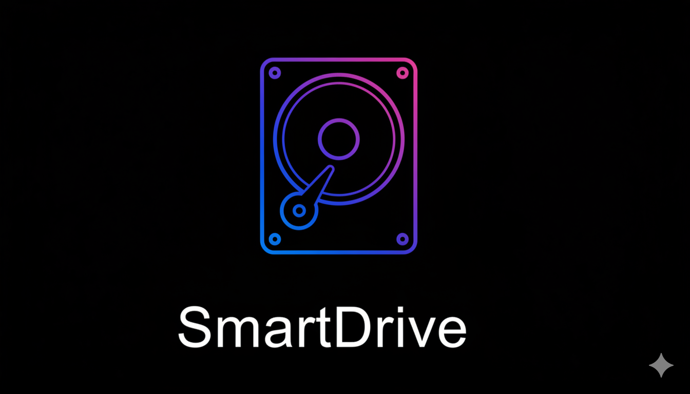

# SmartDrive 🧠☁️

**Semantic search for your entire OneDrive, powered by RAG architecture with Pinecone vector search and Azure Blob Storage.**

SmartDrive is an MCP (Model Context Protocol) server that brings intelligent semantic search to your Microsoft OneDrive documents. Ask Claude to find "tax forms" and it'll surface your 1099s, W-2s, and related docs—even if those exact words aren't in the filename. Built with a true RAG architecture: hybrid vector search (semantic + keyword) in Pinecone, full document storage in Azure Blob.

---

## 🔥 Features

### Core Capabilities
- **RAG Architecture**: True retrieval-augmented generation with vectors in Pinecone, full text in Azure Blob
- **Hybrid Search**: Combines semantic (dense vectors) + keyword (sparse BM25) for maximum accuracy
- **Semantic Search**: Natural language queries - "tax forms" finds W-2s, 1099s, etc.
- **Flexible Embeddings**: Choose local (free, optional), Voyage AI (recommended), Pinecone inference, or OpenAI-compatible APIs
- **ONE Vector Per File**: No chunking = 12.5x faster indexing, simpler search, better results
- **100K Char Embeddings**: Full small docs embedded, intelligent sampling (80% beginning + 20% end) for large files
- **Auto-Refreshing Index**: Background delta sync (Graph `/delta`) — boot + every 15 min, with stale-token fallback
- **Interactive Folder Selection**: Choose which folders to index, skip what you don't need
- **Smart Caching**: Remembers authentication, folder choices, and delta state between runs
- **MCP Integration**: Two tools via Streamable HTTP — `search_onedrive` and `read_document` (any MCP client: Open WebUI, Claude, Inspector)

### Document Support
- **Documents**: PDF (with OCR for scanned docs!), DOCX, DOC
- **Presentations**: PPTX (legacy .ppt not supported - convert to .pptx)
- **Spreadsheets**: XLSX, XLSM, CSV
- **Data**: JSON, TXT, Markdown (MD)
- **Images**: PNG, JPG, TIFF, BMP, GIF (with OCR)
- **Archives**: ZIP files (list contents or extract and index)
- **Graceful Fallbacks**: Corrupted/malformed files indexed with metadata only

### OCR & Document Intelligence
- **Local OCR**: EasyOCR for scanned PDFs and images (free, no external software!)
- **Cloud OCR**: Azure Computer Vision for 10-20x faster processing (optional)
- **Azure Document Intelligence**: Premium AI for forms, tables, invoices, receipts with handwriting support
- **Flexible Modes**: Never, selective (smart detection), or always use Document Intelligence
- **No Setup Required**: Local OCR works out of the box
- **Smart Detection**: Automatically detects scanned PDFs and applies OCR

---

## 📦 Installation

### Prerequisites

- Python 3.10+
- Microsoft 365 account with OneDrive
- Azure account (for Blob Storage - free tier available)
- Pinecone account (free tier available with hybrid search support)
- Any MCP client supporting Streamable HTTP (Open WebUI, Claude, MCP Inspector)

### Quick Setup

1. **Clone the repo**
   ```bash
   git clone https://github.com/1818TusculumSt/smartdrive-mcp.git
   cd smartdrive-mcp
   ```

2. **Install dependencies**
   ```bash
   pip install -r requirements.txt
   ```

   The default requirements do not install local sentence-transformer embeddings.
   If using `EMBEDDING_PROVIDER=local`, install them separately. For CPU-only
   machines, install the CPU PyTorch wheel first to avoid CUDA packages:
   ```bash
   pip install --index-url https://download.pytorch.org/whl/cpu torch
   pip install -r requirements-local.txt
   ```
   Alternatively, use `EMBEDDING_PROVIDER=voyage`, `api`, or `pinecone` and skip
   `requirements-local.txt`.

### Streamable HTTP

The server is **Streamable HTTP-only** (no stdio). Default is `127.0.0.1:8000`, override with `--host`/`--port`:

```bash
python smartdrive_server.py
# or
python smartdrive_server.py --host 127.0.0.1 --port 8083
```

The MCP endpoint is `http://127.0.0.1:8000/mcp` (adjust port if overridden); the health check is
`http://127.0.0.1:8000/healthz`. The server binds `0.0.0.0` inside Docker so the host mapping works. Clients that support Streamable HTTP can use:

```json
{
  "type": "http",
  "url": "http://127.0.0.1:8000/mcp"
}
```

Only run one SmartDrive server instance at a time, since each instance owns its background delta sync loop. Keep it running (terminal, `tmux`, systemd) — clients connect over HTTP, they don't spawn it.

3. **Create Azure App Registration**
   - Go to [Azure Portal](https://portal.azure.com) → **App Registrations** → **New registration**
   - Name: `SmartDrive MCP`
   - Supported accounts: **Personal Microsoft accounts only**
   - Redirect URI: Leave blank
   - After creation, go to **API permissions** → Add:
     - `Files.Read.All`
     - `User.Read`
   - Go to **Authentication** → Enable **Allow public client flows**
   - Copy **Application (client) ID** and **Directory (tenant) ID**

4. **Create Pinecone Index**

   **Option A: Manual Creation (Recommended for most users)**
   - Go to [Pinecone](https://www.pinecone.io/) → Create Index
   - Name: `smartdrive`
   - Dimensions: Choose based on your embedding provider:
     - `384` for local (all-MiniLM-L6-v2)
     - `1024` for Pinecone inference (llama-text-embed-v2)
     - `2048` for Voyage AI (voyage-3-large, recommended)
   - Metric: `cosine`
   - Cloud: AWS (free tier available)
   - Region: Choose closest to you (e.g., `us-east-1`)
   - **Important**: Check "Enable Hybrid Search" for best results (combines semantic + keyword search)
   - Copy your **API Key** and **Index Host** after creation

   **Option B: Automated Creation (Advanced users)**
   ```bash
   # Configure your .env with Pinecone credentials first
   python create_hybrid_index.py
   ```
   - Automatically creates a hybrid search index optimized for Voyage AI
   - Uses 2048 dimensions and dotproduct metric
   - Deletes and recreates existing index (use with caution!)
   - Useful for emergency recovery or scripted deployments

5. **Create Azure Blob Storage Container**
   - Go to [Azure Portal](https://portal.azure.com) → **Storage Accounts** → Create new (or use existing)
   - Choose **Standard** performance tier (general purpose v2)
   - After creation, go to **Access keys** → Copy **Connection string**
   - Create a container named `documents` (or use your own name)

6. **Configure `.env`**

   Copy `.env.example` to `.env` and fill in your values:

   ```env
   # Pinecone (required)
   PINECONE_API_KEY=your_pinecone_api_key
   PINECONE_INDEX_NAME=smartdrive
   PINECONE_HOST=smartdrive-xxxxx.svc.aped-xxxx-xxxx.pinecone.io

   # Microsoft (required)
   MICROSOFT_CLIENT_ID=your_azure_client_id
   MICROSOFT_TENANT_ID=consumers

   # Azure Blob Storage (required for RAG)
   AZURE_STORAGE_CONNECTION_STRING=DefaultEndpointsProtocol=https;AccountName=...
   AZURE_STORAGE_CONTAINER_NAME=documents

   # Embedding provider (optional, default: local)
   EMBEDDING_PROVIDER=local
   EMBEDDING_MODEL=all-MiniLM-L6-v2

   # For Voyage AI (recommended - 32K token context, 2048 dims, $0.10/1M tokens):
   # EMBEDDING_PROVIDER=voyage
   # VOYAGE_API_KEY=your_voyage_api_key
   # VOYAGE_MODEL=voyage-3-large

   # Azure Computer Vision OCR (optional - 10-20x faster than local)
   # AZURE_VISION_KEY=your_azure_vision_key
   # AZURE_VISION_ENDPOINT=https://your-region.api.cognitive.microsoft.com/
   ```

7. **Index your OneDrive**
   ```bash
   python onedrive_crawler.py
   ```

   You'll see an interactive menu:
   ```
   ============================================================
   📋 SmartDrive Crawler - Main Menu
   ============================================================
   1. Run crawler (use cached folder choices)
   2. Reset folder choices and start fresh
   3. View/edit cached folder choices
   4. Exit
   ```

   - First time: Choose option 1
   - Authenticate with your Microsoft account (device code flow)
   - Choose ZIP handling (list contents or extract - default is list)
   - Set file limit (or press Enter for no limit to index everything)
   - Answer Yes/No for each folder as the crawler discovers them
   - Use "always yes" or "skip always" to remember your choices!

 8. **Start the Streamable HTTP server**

     ```bash
     python smartdrive_server.py
     # MCP endpoint: http://127.0.0.1:8000/mcp
     # Health check: http://127.0.0.1:8000/healthz
     ```

     The server must be running before clients connect. Keep it running in a terminal, `tmux`, or a systemd service. Env vars come from the server's shell/systemd/Docker environment. Base requirements no longer include `sentence-transformers` — for `EMBEDDING_PROVIDER=local` also run `pip install -r requirements-local.txt` (CPU-only: install `torch` CPU wheel first).

     Add the server to any MCP client that supports Streamable HTTP:

     ```json
     {
       "mcpServers": {
         "smartdrive": {
           "type": "http",
           "url": "http://127.0.0.1:8000/mcp"
         }
       }
     }
     ```

     **Note**: The MCP server only needs Pinecone and Azure Blob Storage credentials. The crawler/delta sync need additional credentials (Microsoft Graph API, OCR services, embedding API keys).

9. **Verify the server**

     ```bash
     curl http://127.0.0.1:8000/healthz
     # Docker (host port may differ if you remapped 127.0.0.1:8083:8000):
     docker exec openwebui curl -s http://host.docker.internal:8000/healthz  # needs extra_hosts on the client container
     # or via shared network:
     # docker exec openwebui curl -s http://smartdrive-mcp:8000/healthz
     ```

---

## 🐳 Docker Setup (Recommended)

**Why Docker?**
- ✅ **Zero system pollution** - isolated environment
- ✅ **No dependency conflicts** - all Python packages contained
- ✅ **Reproducible** - works identically everywhere
- ✅ **Easy cleanup** - remove container, done
- ✅ **Persistent cache** - OAuth tokens and folder choices survive restarts

### Docker Quick Start

1. **Clone and configure**
   ```bash
   git clone https://github.com/1818TusculumSt/smartdrive-mcp.git
   cd smartdrive-mcp
   cp .env.example .env
   # Edit .env with your credentials
   ```

2. **Build and run**
   ```bash
   docker-compose up -d
   ```

3. **Index your OneDrive (first time)**
   ```bash
   docker-compose run --rm smartdrive-mcp python onedrive_crawler.py
   ```

4. **Subsequent runs** (use cached folder choices)
   ```bash
   docker-compose run --rm smartdrive-mcp
   ```

### Docker Commands

```bash
# Build the image
docker-compose build

# Run crawler interactively (uses host .env + cache mounts)
docker-compose run --rm smartdrive-mcp python onedrive_crawler.py
# Manual delta sync
docker-compose run --rm smartdrive-mcp python delta_sync.py sync

# View logs
docker-compose logs -f

# Stop container
docker-compose down

# Rebuild after code changes
docker-compose build --no-cache

# Clean up everything (keeps .env and cache files)
docker-compose down --rmi all
```

### Cache Persistence

Docker mounts these from your host (create empty files first to avoid Docker creating directories):
```bash
touch ~/.smartdrive_token_cache.json ~/.smartdrive_folder_skip_cache.json ~/.smartdrive_delta_store.json
```
- `~/.smartdrive_token_cache.json` - OAuth tokens (survives restarts)
- `~/.smartdrive_folder_skip_cache.json` - Folder choices (remembers skip/process decisions)
- `~/.smartdrive_delta_store.json` - Delta sync state (deltaLink + item map; avoids full resync)
- `~/.EasyOCR/` - OCR models (avoids re-downloading 100MB)

### Using with MCP clients (Open WebUI, Claude, Inspector)

Start the container (it runs the Streamable HTTP server on `0.0.0.0:8000` inside, mapped to `127.0.0.1:8000` on the host):

```bash
docker-compose up -d
curl http://127.0.0.1:8000/healthz   # verify (use your host-mapped port if you changed 8000 → 8083)
```

If your client runs in Docker on a **separate** network (e.g., Open WebUI), keep them separate and use `host.docker.internal` — add to the *client's* compose:

```yaml
extra_hosts:
  - "host.docker.internal:host-gateway"
```

Then point the client at the host-mapped URL:

```json
{
  "mcpServers": {
    "smartdrive": {
      "type": "http",
      "url": "http://host.docker.internal:8000/mcp"
    }
  }
}
```

If they share `smartdrive-net` (`docker network connect smartdrive-net openwebui`), use the in-network name instead:

```json
{
  "mcpServers": {
    "smartdrive": {
      "type": "http",
      "url": "http://smartdrive-mcp:8000/mcp"
    }
  }
}
```

**Common pitfall:** inside the client container `127.0.0.1` is itself. `host.docker.internal` or the shared service name is required when the client is containerized.

---

## 🚀 Usage

### MCP tools

SmartDrive provides two MCP tools to any connected client:

**1. `search_onedrive` - Hybrid semantic + keyword search**
- Searches Pinecone with dense (semantic) + sparse (BM25/keyword) vectors
- Returns top-k results with file paths, dates, scores, and content previews
- Automatically fetches full text from Azure Blob for matched documents
- Smart truncation keeps responses under 900KB (shows first 2K chars per doc)

**2. `read_document` - Retrieve full document text**
- Fetches complete document content from Azure Blob Storage by `doc_id`
- Use this when you need the full text of a search result
- Returns entire document (no truncation)

Simply ask your assistant natural language questions:

- "Search my OneDrive for resume"
- "Find tax documents from 2024"
- "Show me project proposals"
- "Where are my meeting notes about the Q4 budget?"
- "Read the full content of document doc_abc123" (after getting doc_id from search)

The client will automatically use `search_onedrive` to find relevant documents and `read_document` to retrieve full content.

### Interactive Crawler Menu

The crawler has a full menu system for managing your indexing:

**Option 1: Run Crawler**
- Choose ZIP handling (list or extract contents)
- Set file limit (or no limit for full index)
- Interactive folder selection
- Beautiful progress tracking with OCR status

**Option 2: Reset Folder Choices**
- Clear all cached folder preferences
- Start fresh with folder selection

**Option 3: View/Edit Cached Folder Choices**
- See all your saved folder decisions
- Toggle folders between SKIP and PROCESS
- Delete specific cached choices

### Processing Summary

After crawling, you'll get a detailed summary:

```
============================================================
📊 Processing Summary:
============================================================
✅ Successfully extracted: 847 files

❌ Failed extractions (3):
   • corrupted_report.xlsx (.xlsx)
   • malformed_doc.pdf (.pdf)

⚠️ Unsupported file types (5):
   • .mp4: 2 file(s)
   • .zip: 3 file(s)
============================================================
```

---

## 🏗️ Architecture

SmartDrive uses a **true RAG (Retrieval Augmented Generation) architecture** that separates vector embeddings from document storage for optimal performance and unlimited document size support.

```
┌─────────────────┐
│  MCP Client     │  (Open WebUI / Claude / Inspector)
└────────┬────────┘
         │ Streamable HTTP
         ▼
┌─────────────────────┐       ┌──────────────────┐
│ smartdrive_server.py│◄──────┤  Pinecone Index  │
│  (Streamable HTTP)  │       │ (Hybrid Vectors) │
└────────┬────────────┘       └──────────────────┘
         │                             │
         │  background delta sync      ├─ Dense vectors (semantic)
         │  (Graph /delta)             ├─ Sparse vectors (BM25/keyword)
         │  every 15 min               ├─ Minimal metadata
         │                             └─ doc_id references
         │
         └──► ┌──────────────────┐
              │  Azure Blob      │
              │  (Full Texts)    │
              └──────────────────┘
                      ├─ Complete documents
                      ├─ Unlimited size
                      └─ Fast retrieval (~50ms)
```

### How It Works

**1. Indexing (onedrive_crawler.py + delta_sync.py)**

Manual `onedrive_crawler.py` and background `delta_sync.py` share the same extract→embed→upsert pipeline (`indexing_core.py`). For each file:

1. **Authenticate** via Microsoft Graph API (device code flow, cached)
2. **Crawl OneDrive** recursively with interactive folder selection
3. **Extract text** from documents:
   - **PDFs**: PyMuPDF (fitz) extracts text directly
   - **Scanned PDFs/Images**: OCR with Azure Document Intelligence → Azure Computer Vision → EasyOCR fallback chain
   - **Office docs**: python-docx (DOCX), python-pptx (PPTX), openpyxl (XLSX)
   - **Text files**: Direct read (TXT, JSON, MD, CSV)
   - **Archives**: List or extract ZIP contents
4. **Generate embeddings**:
   - **Dense vector**: Configurable provider (local/Voyage AI/Pinecone/OpenAI-compatible API)
   - **Sparse vector**: BM25 encoder for keyword matching (auto-truncates to 2048 terms)
   - Up to 100K chars embedded (smart sampling: 80% beginning + 20% end for large files)
5. **Store in two places**:
   - **Azure Blob Storage**: Full document text → returns `doc_id` (SHA256 hash of file path)
   - **Pinecone**: Dense + sparse vectors + minimal metadata + `doc_id` reference
 6. **Incremental/manual sync**: Crawler checks Pinecone metadata; delta sync uses `item_map` + `modified`/`size` to skip unchanged, deletes via `ContainerNotFound`-safe path
 7. **Auto-refresh**: `delta_sync.py` via Graph `root/delta` — full enumeration on first run/410, incremental thereafter; respects folder skip cache; runs inside the server process
 8. **Cleanup**: Removes stale vectors from Pinecone + orphaned blobs from Azure (including moves/renames via path-derived IDs)

**2. Searching (smartdrive_server.py)**

When any MCP client searches your OneDrive:

1. **Query embedding**: Convert natural language query to dense + sparse vectors
2. **Hybrid search**: Query Pinecone with both vectors for semantic + keyword matching
3. **Retrieve matches**: Get top-k results with `doc_id` and metadata
4. **Fetch full text**: Retrieve complete documents from Azure Blob using `doc_id`
5. **Smart truncation**: Preview first 2K chars per result, keep total response <900KB
6. **Return to Claude**: Formatted results with file paths, dates, scores, and content

### Components

**Core Files:**
- [smartdrive_server.py](smartdrive_server.py) - Streamable HTTP MCP server exposing `search_onedrive` and `read_document`; owns the background delta sync loop
- [delta_sync.py](delta_sync.py) - Graph delta sync (`/me/drive/root/delta`, client-side `/Documents` filter, 410 fallback, `item_map` for id-only deletes)
- [indexing_core.py](indexing_core.py) - Shared side-effect-free extract→embed→upsert pipeline (used by both crawler and delta sync)
- [onedrive_crawler.py](onedrive_crawler.py) - Interactive manual CLI (imports from `indexing_core.py`, never imported by the server)
- [embeddings.py](embeddings.py) - Embedding provider abstraction (local/Voyage/Pinecone/OpenAI-compatible APIs)
- [document_storage.py](document_storage.py) - Azure Blob Storage interface for full document text
- [document_intelligence.py](document_intelligence.py) - Azure Document Intelligence integration for advanced form/table extraction
- [config.py](config.py) - Configuration management with pydantic-settings

**Dependencies:**
- **Pinecone**: Vector database for hybrid search (dense + sparse vectors)
- **Azure Blob Storage**: Document storage (full text, unlimited size)
- **Microsoft Graph API**: OneDrive file access (device code flow auth; delta sync is silent-only)
- **PyMuPDF (fitz)**: PDF text extraction
- **python-docx, python-pptx, openpyxl**: Office document parsing
- **EasyOCR**: Local OCR fallback (CPU-based, ~10-30 sec/page)
- **Azure Computer Vision** (optional): Cloud OCR (10-20x faster, ~1-3 sec/page)
- **Azure Document Intelligence** (optional): Advanced form/table extraction
- **sentence-transformers** (optional, `requirements-local.txt`): Local embedding model (default: all-MiniLM-L6-v2)
- **pinecone-text**: BM25 encoder for sparse vectors (keyword matching)

### Key Architecture Decisions

**Why RAG (vectors separate from full text)?**
- ✅ **No metadata limits**: Pinecone has 40KB metadata cap, Azure Blob has unlimited storage
- ✅ **ONE vector per file**: No chunking = 12.5x faster indexing, simpler search
- ✅ **Full context retrieval**: Search finds relevant docs, then retrieves complete text
- ✅ **Cost-efficient**: ~$0.02/GB/month Azure storage vs expensive vector metadata

**Why hybrid search (dense + sparse)?**
- ✅ **Dense vectors**: Semantic understanding ("tax forms" matches "W-2", "1099")
- ✅ **Sparse vectors**: Exact keyword matching (filename search, acronyms)
- ✅ **Better accuracy**: Combines semantic similarity with keyword precision

**Why 100K char embeddings?**
- ✅ **Full document understanding**: Entire small docs embedded, smart sampling for large ones
- ✅ **No chunking overhead**: 1 vector vs 10+ per file
- ✅ **Faster search**: Fewer vectors to query
- ✅ **More context**: Voyage AI supports 32K tokens (128K chars), we use 100K for efficiency

**Why incremental sync?**
- ✅ **Speed**: Skips unchanged files (~100x faster for re-indexing)
- ✅ **Cost savings**: No re-embedding unchanged documents
- ✅ **Metadata comparison**: Checks modified date + file size in Pinecone before extraction

---

## 🛠️ Configuration

### Embedding Providers

SmartDrive supports four embedding providers:

#### Local (Free, Private)
```env
EMBEDDING_PROVIDER=local
EMBEDDING_MODEL=all-MiniLM-L6-v2
```
- ✅ Runs on your machine (sentence-transformers)
- ✅ No API calls or costs
- ✅ Complete privacy
- 📊 384 dimensions, ~512 token context

#### Voyage AI (Recommended for Large Documents) 🚀
```env
EMBEDDING_PROVIDER=voyage
VOYAGE_API_KEY=your_voyage_api_key
VOYAGE_MODEL=voyage-3-large
```
- ✅ **32,000 token context** (128K chars) - embed entire 50+ page PDFs!
- ✅ **2048 dimensions** for maximum quality
- ✅ Fast cloud API, optimized for long documents
- 💰 **$0.10 per 1M tokens** (~$0.10-0.50 for 600 typical files)
- 🎯 Best for: Academic papers, books, reports, large documents

#### Pinecone Inference
```env
EMBEDDING_PROVIDER=pinecone
EMBEDDING_MODEL=llama-text-embed-v2
```
- Hosted embedding models via Pinecone
- 1024 dimensions (high quality)
- Requires Pinecone API key
- Access to specialized models

#### Custom API
```env
EMBEDDING_PROVIDER=api
EMBEDDING_API_URL=https://your-api.com/embeddings
EMBEDDING_API_KEY=your_api_key
EMBEDDING_MODEL=your-model-name
```
- OpenAI-compatible API format
- Use any embedding service (OpenAI, Cohere, etc.)
- Self-hosted options supported

### Incremental Sync

SmartDrive intelligently skips unchanged files to save time and API costs:

- ✅ **Pre-extraction check**: Checks Pinecone before downloading/extracting files
- ✅ **Metadata comparison**: Compares file modified date and size
- ✅ **Skip unchanged**: Files that haven't changed are skipped entirely
- ✅ **Update only modified**: Only re-indexes files that changed
- ⚡ **~100x faster** for re-indexing mostly unchanged folders

**New Folder Detection**: When running with cached folder choices, you can optionally check for new folders:
- Press Enter = Skip check (fast, uses cache only)
- Type 'check' = Discover new folders and prompt for each one

### OCR Configuration

SmartDrive supports two OCR methods:

#### Local OCR (EasyOCR - Default)
- **Free** and works out of the box
- Downloads models automatically on first use (~100MB)
- **Speed**: 10-30 seconds per page
- No external dependencies

#### Cloud OCR (Azure Computer Vision - Optional)
Add to your `.env`:
```env
AZURE_VISION_KEY=your_azure_vision_key
AZURE_VISION_ENDPOINT=https://your-region.api.cognitive.microsoft.com/
```

**Benefits:**
- **10-20x faster**: 1-3 seconds per page vs 10-30 seconds
- More accurate OCR results
- No CPU/GPU load on your machine
- **Free tier**: 5,000 pages/month
- **Paid tier**: $1.50 per 1,000 pages (~$0.50-$2 for typical use)

**Setup:**
1. Go to [Azure Portal](https://portal.azure.com)
2. Create "Computer Vision" resource
3. Choose "Free F0" tier (5,000 pages/month) or "Standard S1"
4. Copy your API key and endpoint to `.env`

#### OCR Strict Mode (Optional)
Force Azure OCR only (no EasyOCR fallback):
```env
OCR_STRICT_MODE=true
```

When enabled:
- ✅ Only uses Azure OCR (10-20x faster)
- ❌ Files fail if Azure OCR fails (no slow EasyOCR fallback)
- 💡 Use this for speed when you have Azure credits

SmartDrive will automatically use Azure OCR if credentials are provided, otherwise falls back to local EasyOCR (unless strict mode is enabled).

### Azure Document Intelligence (Advanced)

Azure Document Intelligence (formerly Form Recognizer) is a premium AI service that provides advanced extraction capabilities beyond basic OCR. It's specifically designed for structured documents like forms, invoices, receipts, and tax documents.

**What It Does:**
- **Intelligent form extraction**: Automatically identifies and extracts key-value pairs from forms
- **Table extraction**: Preserves table structure with rows, columns, and cell relationships
- **Handwriting recognition**: Accurately recognizes handwritten text
- **Layout analysis**: Understands document structure (headers, sections, paragraphs)
- **Pre-built models**: Optimized for invoices, receipts, tax forms, ID documents

**Three Operating Modes:**

1. **`never` (default)**: Document Intelligence is disabled
   - Uses standard Azure OCR → EasyOCR fallback chain
   - Fastest and most cost-effective for simple documents

2. **`selective` (smart detection)**: Automatically enabled for specific document types
   - Activates when filenames contain keywords: `tax`, `invoice`, `receipt`, `form`, `w2`, `1099`, `w-2`, `1040`
   - Perfect balance of cost and capability
   - Recommended for mixed document libraries

3. **`always`**: Uses Document Intelligence for ALL documents
   - Maximum extraction quality for every file
   - Higher cost - only use if you need advanced extraction for all documents

**Pricing & Limits:**

**Free Tier (F0):**
- **Cost**: Free
- **Limitations**: Only processes **first 2 pages** of multi-page documents
- **Monthly limit**: 500 pages per month
- **Speed**: 1 transaction per second (TPS)
- **Best for**: Testing, small document sets, or documents that are 1-2 pages

**Standard Tier (S0):**
- **Cost**: **$1.50 per 1,000 pages**
- **Full document processing**: All pages extracted, no page limits
- **No monthly limits**: Pay-per-use
- **Speed**: 15 TPS
- **Typical cost**: ~$0.75 for 500 pages (vs free tier's first-2-pages limitation)
- **Recommended for**: Production use, multi-page documents

**Setup Instructions:**

1. Go to [Azure Portal](https://portal.azure.com)
2. Create a **"Document Intelligence"** resource (or search "Form Recognizer")
3. Choose tier:
   - **Free F0**: Testing or 1-2 page documents only
   - **Standard S0**: Production use with full document extraction
4. After creation, go to **"Keys and Endpoint"**
5. Copy **KEY 1** and **Endpoint URL**
6. Add to your `.env`:

```env
AZURE_FORM_RECOGNIZER_KEY=your_key_here
AZURE_FORM_RECOGNIZER_ENDPOINT=https://your-region.cognitiveservices.azure.com/

# Choose your mode:
USE_DOCUMENT_INTELLIGENCE=selective  # never, selective, or always
```

**Fallback Chain:**

SmartDrive uses a sophisticated fallback system:
1. **Azure Document Intelligence** (if enabled and conditions met)
2. **Azure Computer Vision OCR** (if credentials provided)
3. **EasyOCR** (local, always available)

**Performance:**
- **Processing time**: 5-15 seconds per document (varies with page count and complexity)
- **Timeout**: 2-minute safety timeout prevents hanging on problematic files
- **Progress indicator**: Real-time page-by-page progress for multi-page documents
- **Reliability**: Automatic fallback if service is unavailable or times out

**Best Use Cases:**
- Tax documents (W-2, 1099, 1040 forms)
- Invoices and receipts with complex layouts
- Business forms with structured fields
- Contracts with tables and signatures
- Handwritten notes and forms
- Documents requiring precise table extraction

**Tips:**
- Start with `selective` mode to balance cost and quality
- Use `always` mode only if you need advanced extraction for every document
- Free tier (F0) is fine for testing, but upgrade to S0 for production multi-page documents
- Monitor your usage in Azure Portal to stay within budget

### Indexing Customization

**File Limits:**
- Test with 50-100 files first
- Then press Enter for no limit to index everything

**Folder Selection:**
- Interactive prompts for every folder
- Use "always" options to cache your choices
- Edit choices anytime via the menu (Option 3)

**ZIP File Handling:**
- Default: List contents (fast, searchable by filename and file list)
- Extract: Full text extraction from files inside ZIPs (slower, comprehensive)

---

## 📊 Supported File Formats

| Category | Formats | OCR Support |
|----------|---------|-------------|
| Documents | PDF, DOCX, DOC | ✅ (scanned PDFs) |
| Presentations | PPTX | - |
| Spreadsheets | XLSX, XLSM, XLTX, XLTM, CSV | - |
| Data | JSON, TXT, Markdown (MD) | - |
| Images | PNG, JPG, JPEG, TIFF, BMP, GIF | ✅ |
| Archives | ZIP | List or Extract |

**Note**: Legacy PowerPoint (.ppt) files are not supported. Convert to .pptx for full-text extraction.

---

## 🎯 Best Practices

### For Large OneDrive Libraries (10GB+)

1. **Test First**: Start with 100-file limit
2. **Choose Folders Wisely**: Skip temp folders, downloads, etc.
3. **ZIP Strategy**: Use "list" mode for most ZIPs (faster)
4. **Run Overnight**: Full indexing of large libraries can take hours
5. **Monitor Progress**: OCR shows page-by-page progress

### For Best Search Results

1. **Descriptive Queries**: "Find project proposals from Q4" works better than "proposals"
2. **Use Context**: Include timeframes, topics, or people names
3. **Iterative Search**: Refine based on initial results

### Maintaining Your Index

1. **Automatic**: Background delta sync keeps the index fresh (boot + every `SMARTDRIVE_SYNC_INTERVAL` seconds, default 15 min; `0` = boot only)
2. **Manual**: Re-run `python onedrive_crawler.py` for interactive control, or `python delta_sync.py sync` for a one-shot delta sync
3. **Cached Choices**: Folder preferences (`~/.smartdrive_folder_skip_cache.json`) and delta state (`~/.smartdrive_delta_store.json`) persist between runs

---

## 🐛 Troubleshooting

### Common Issues

**"OCR failed" warnings**
- This is expected for some scanned PDFs
- Text extraction falls back to whatever is available
- Most documents work fine

**Excel parsing errors**
- Some complex XLSX files may fail
- CSV is more reliable for data files

**Authentication timeout**
- Tokens are cached - just re-run if expired
- Delete `~/.smartdrive_token_cache.json` to force re-auth

**Slow processing**
- OCR takes 3-10 seconds per page
- Normal for scanned documents
- Progress indicators show it's working

### Need Help?

Open a GitHub issue with:
- Error message (if any)
- File type causing issues
- Steps to reproduce

---

## 🗺️ Roadmap

### Completed ✅

**Core Features:**
- ✅ Recursive folder crawling with interactive selection
- ✅ Interactive folder selection with caching
- ✅ New folder detection (optional pre-crawl check)
- ✅ Incremental sync (pre-extraction Pinecone check)
- ✅ Token caching for Microsoft authentication
- ✅ Progress indicators and comprehensive error reporting
- ✅ Graceful fallbacks for corrupted files

**File Format Support:**
- ✅ Documents: PDF, DOCX, DOC
- ✅ Spreadsheets: XLSX, XLSM, CSV
- ✅ Data: JSON, TXT, Markdown (.md)
- ✅ Images: PNG, JPG, TIFF, BMP, GIF (with OCR)
- ✅ Archives: ZIP (list + extract modes)

**OCR & Document Intelligence:**
- ✅ Local OCR (EasyOCR) with automatic model download
- ✅ Cloud OCR (Azure Computer Vision) for 10-20x speedup
- ✅ Azure Document Intelligence with three modes (never/selective/always)
- ✅ Scanned PDF OCR with page-by-page progress
- ✅ Image OCR via Document Intelligence (all formats)
- ✅ Smart timeout handling (2-minute safety)
- ✅ OCR strict mode (Azure-only, no fallback)

**RAG Architecture:**
- ✅ **True RAG implementation**: Vectors in Pinecone, full text in Azure Blob Storage
- ✅ **ONE vector per file** (no chunking, 12.5x faster uploads)
- ✅ **100K char embeddings** (entire small docs, intelligent sampling for large)
- ✅ **2048-dimension Voyage AI** embeddings for maximum quality (configurable: 384/1024/2048)
- ✅ **Hybrid search**: Dense (semantic) + sparse (BM25/keyword) vectors
- ✅ **Rich metadata**: File type categorization, size, dates, coverage indicator
- ✅ **Azure Blob Storage**: Unlimited document size storage (~$0.02/GB/month)
- ✅ **Smart cleanup**: Removes stale docs from both Pinecone and Azure
- ✅ **Duplicate prevention**: Azure checks existence before upload
- ✅ **Sparse vector handling**: Auto-truncates to 2048 terms (Pinecone limit)
- ✅ **Two MCP tools**: `search_onedrive` (hybrid search) + `read_document` (full text retrieval)
- ✅ **Smart result truncation**: Keeps responses under 900KB to prevent MCP 1MB limit issues

**Embedding Providers:**
- ✅ Local embeddings (sentence-transformers, free)
- ✅ Voyage AI (32K token context, 2048 dims, optimized for long docs)
- ✅ Pinecone inference (llama-text-embed-v2, 1024 dims)
- ✅ Custom API (OpenAI-compatible endpoints)

### Recently Completed ✅ — Incremental Sync Daemon
- **Microsoft Graph Delta API** (`/me/drive/root/delta`) — incremental via `deltaLink`, full enumeration on 410/404; no `?token=` bootstrap on personal accounts
- **Background inside the one server** — `asyncio.to_thread` so search never blocks; silent-only auth; log-never-raise
- **`item_map` for id-only deletes** — Graph deletes are id-only; path-derived `doc_id`/`vector_id` resolved via persistent map; moves/renames delete old + re-index new
- **Folder-aware** — respects `~/.smartdrive_folder_skip_cache.json` (process / list-only / skip)
- **Streamable HTTP-only transport** — `Uvicorn` + `Starlette` + `StreamableHTTPSessionManager` (`stateless=True`, `json_response=True`); host port remapping documented for `host.docker.internal`

#### Other Features
- [ ] Support for SharePoint/Teams files
- [ ] Configurable crawl depth
- [ ] Custom metadata extraction
- [ ] Multi-language OCR

---

## 🤝 Contributing

Built for the community, by the community. PRs welcome!

**Areas we'd love help with:**
- Performance optimizations
- Documentation improvements
- Unit tests
- Additional file formats (e.g., RTF, ODT)

---

## 📄 License

MIT License - do whatever you want with this, just keep it free and accessible.

---

## 🙏 Acknowledgments

- Built with [MCP](https://modelcontextprotocol.io/) by Anthropic
- Embeddings via [sentence-transformers](https://www.sbert.net/)
- Vector storage by [Pinecone](https://www.pinecone.io/)
- Microsoft Graph API for OneDrive access
- OCR powered by [EasyOCR](https://github.com/JaidedAI/EasyOCR)
- PDF processing via [PyMuPDF](https://pymupdf.readthedocs.io/)

---

## 💬 Support

Questions? Issues? Open a GitHub issue or reach out.

Built with 🔥 by [@1818TusculumSt](https://github.com/1818TusculumSt)

---

## 💰 Cost Breakdown

**Free Tier Setup (Recommended for Testing):**
- ✅ **Embeddings**: Local (sentence-transformers) - $0/month
- ✅ **Pinecone**: Free tier - 100K vectors, hybrid search enabled - $0/month
- ✅ **Azure Blob Storage**: Free tier - 5GB, 20K read ops/month - $0/month
- ✅ **OCR**: Local EasyOCR - $0/month (slower but free)
- **Total**: $0/month for small-to-medium OneDrive libraries (<1000 files)

**Production Setup (Recommended for Large Libraries):**
- 💰 **Embeddings**: Voyage AI - ~$0.10-0.50 for 600 typical files (one-time indexing cost)
- 💰 **Pinecone**: Serverless - ~$0.03/month per 100K vectors (pay-as-you-go)
- 💰 **Azure Blob Storage**: ~$0.02/GB/month (~$0.02/month for 500 docs @ 50KB avg)
- 💰 **OCR** (optional): Azure Computer Vision - Free tier: 5K pages/month, Paid: $1.50/1000 pages
- **Total**: ~$0.50-2.00/month for typical use (1000-5000 files)

**Tips to Minimize Costs:**
- Use local embeddings (free) instead of Voyage AI if you don't need 32K token context
- Azure Blob free tier covers most personal use cases (5GB = ~100K documents)
- Pinecone free tier covers up to 100K vectors (plenty for personal OneDrive)
- Local EasyOCR is free but slow - use Azure OCR only if you have lots of scanned docs
