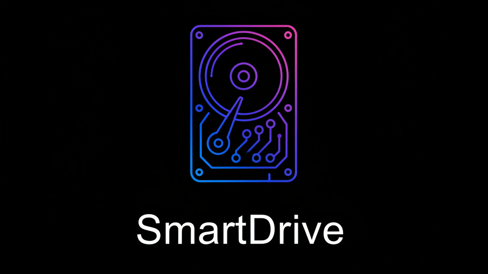

# SmartDrive 🧠☁️

**Semantic search for your entire OneDrive, powered by Pinecone vector search.**

SmartDrive is an MCP (Model Context Protocol) server that brings intelligent semantic search to your Microsoft OneDrive documents. Ask Claude to find "tax forms" and it'll surface your 1099s, W-2s, and related docs—even if those exact words aren't in the filename.

---

## 🔥 Features

### Core Capabilities
- **Semantic Search**: Natural language queries across your entire OneDrive
- **Flexible Embeddings**: Choose local (free), Pinecone inference, or custom API
- **Privacy-First**: Your documents stay in your OneDrive; only embeddings are stored
- **MCP Integration**: Works natively with Claude Desktop
- **Interactive Folder Selection**: Choose which folders to index, skip what you don't need
- **Smart Caching**: Remembers authentication and folder choices between runs

### Document Support
- **Documents**: PDF (with OCR for scanned docs!), DOCX, DOC
- **Presentations**: PPTX, PPT
- **Spreadsheets**: XLSX, XLSM, CSV
- **Data**: JSON, TXT, Markdown (MD)
- **Images**: PNG, JPG, TIFF, BMP, GIF (with OCR)
- **Archives**: ZIP files (list contents or extract and index)

### OCR Support
- **Built-in OCR**: EasyOCR for scanned PDFs and images (no external software needed!)
- **No Setup Required**: Works out of the box, downloads models automatically
- **Smart Detection**: Automatically detects scanned PDFs and applies OCR

---

## 📦 Installation

### Prerequisites

- Python 3.10+
- Microsoft 365 account with OneDrive
- Pinecone account (free tier works)
- Claude Desktop

### Quick Setup

1. **Clone the repo**
   ```bash
   git clone https://github.com/1818TusculumSt/smartdrive-mcp.git
   cd smartdrive-mcp
   ```

2. **Install dependencies**
   ```bash
   pip install -r requirements.txt
   ```

3. **Create Azure App Registration**
   - Go to [Azure Portal](https://portal.azure.com) → **App Registrations** → **New registration**
   - Name: `SmartDrive MCP`
   - Supported accounts: **Personal Microsoft accounts only**
   - Redirect URI: Leave blank
   - After creation, go to **API permissions** → Add:
     - `Files.Read.All`
     - `User.Read`
   - Go to **Authentication** → Enable **Allow public client flows**
   - Copy **Application (client) ID** and **Directory (tenant) ID**

4. **Create Pinecone Index**
   - Go to [Pinecone](https://www.pinecone.io/) → Create Index
   - Name: `smartdrive`
   - Dimensions: `384`
   - Metric: `cosine`
   - Vector type: `dense`
   - Copy your **API Key** and **Index Host**

5. **Configure `.env`**

   Copy `.env.example` to `.env` and fill in your values:

   ```env
   PINECONE_API_KEY=your_pinecone_api_key
   PINECONE_INDEX_NAME=smartdrive
   PINECONE_HOST=smartdrive-xxxxx.svc.aped-xxxx-xxxx.pinecone.io

   MICROSOFT_CLIENT_ID=your_azure_client_id
   MICROSOFT_TENANT_ID=consumers

   # Optional: Choose your embedding provider (local, pinecone, or api)
   EMBEDDING_PROVIDER=local
   EMBEDDING_MODEL=all-MiniLM-L6-v2
   ```

6. **Index your OneDrive**
   ```bash
   python onedrive_crawler.py
   ```

   You'll see an interactive menu:
   ```
   ============================================================
   📋 SmartDrive Crawler - Main Menu
   ============================================================
   1. Run crawler (use cached folder choices)
   2. Reset folder choices and start fresh
   3. View/edit cached folder choices
   4. Exit
   ```

   - First time: Choose option 1
   - Authenticate with your Microsoft account (device code flow)
   - Choose ZIP handling (list contents or extract - default is list)
   - Set file limit (or press Enter for no limit to index everything)
   - Answer Yes/No for each folder as the crawler discovers them
   - Use "always yes" or "skip always" to remember your choices!

7. **Add to Claude Desktop**

   Edit `%APPDATA%\Claude\claude_desktop_config.json` (Windows) or `~/Library/Application Support/Claude/claude_desktop_config.json` (Mac):

   ```json
   {
     "mcpServers": {
       "smartdrive": {
         "command": "python",
         "args": [
           "C:\\path\\to\\smartdrive-mcp\\smartdrive_server.py"
         ],
         "env": {
           "PINECONE_API_KEY": "your_pinecone_api_key",
           "PINECONE_INDEX_NAME": "smartdrive",
           "PINECONE_HOST": "smartdrive-xxxxx.svc.aped-xxxx-xxxx.pinecone.io"
         }
       }
     }
   }
   ```

8. **Restart Claude Desktop**

---

## 🚀 Usage

### In Claude Desktop

Simply ask Claude natural language questions:

- "Search my OneDrive for resume"
- "Find tax documents from 2024"
- "Show me project proposals"
- "Where are my meeting notes about the Q4 budget?"

SmartDrive will semantically search your indexed documents and return relevant results with file paths, modification dates, and content previews.

### Interactive Crawler Menu

The crawler has a full menu system for managing your indexing:

**Option 1: Run Crawler**
- Choose ZIP handling (list or extract contents)
- Set file limit (or no limit for full index)
- Interactive folder selection
- Beautiful progress tracking with OCR status

**Option 2: Reset Folder Choices**
- Clear all cached folder preferences
- Start fresh with folder selection

**Option 3: View/Edit Cached Folder Choices**
- See all your saved folder decisions
- Toggle folders between SKIP and PROCESS
- Delete specific cached choices

### Processing Summary

After crawling, you'll get a detailed summary:

```
============================================================
📊 Processing Summary:
============================================================
✅ Successfully extracted: 847 files

❌ Failed extractions (3):
   • corrupted_report.xlsx (.xlsx)
   • malformed_doc.pdf (.pdf)

⚠️ Unsupported file types (5):
   • .mp4: 2 file(s)
   • .zip: 3 file(s)
============================================================
```

---

## 🏗️ Architecture

```
┌─────────────────┐
│  Claude Desktop │
└────────┬────────┘
         │ MCP Protocol
         ▼
┌─────────────────────┐
│ smartdrive_server.py│
│  (MCP Server)       │
└────────┬────────────┘
         │
         ├──► sentence-transformers (local embeddings)
         │
         └──► Pinecone (vector storage)
```

**Crawler Flow:**
1. `onedrive_crawler.py` authenticates via Microsoft Graph API (cached for future runs)
2. Recursively crawls your Documents folder
3. Extracts text from documents (PDF, DOCX, DOC, PPTX, XLSX, CSV, JSON, Markdown, images)
4. Applies OCR to scanned PDFs and images automatically
5. Generates embeddings using configured provider
6. Stores vectors + metadata in Pinecone

**Search Flow:**
1. Claude sends query to MCP server
2. Query embedded using configured provider
3. Pinecone returns top-k similar vectors
4. Results formatted with file metadata

---

## 🛠️ Configuration

### Embedding Providers

SmartDrive supports three embedding providers:

#### Local
```env
EMBEDDING_PROVIDER=local
EMBEDDING_MODEL=all-MiniLM-L6-v2
```
- Runs on your machine (sentence-transformers)
- No API calls or costs
- Complete privacy

#### Pinecone Inference
```env
EMBEDDING_PROVIDER=pinecone
EMBEDDING_MODEL=multilingual-e5-large
```
- Hosted embedding models via Pinecone
- Requires Pinecone API key
- Access to specialized models

#### Custom API
```env
EMBEDDING_PROVIDER=api
EMBEDDING_API_URL=https://your-api.com/embeddings
EMBEDDING_API_KEY=your_api_key
EMBEDDING_MODEL=your-model-name
```
- OpenAI-compatible API format
- Use any embedding service (OpenAI, Cohere, etc.)
- Self-hosted options supported

### OCR Configuration

OCR works out of the box with EasyOCR! For advanced users:

- See [SETUP_OCR.md](SETUP_OCR.md) for optional Tesseract setup (2-3x faster)
- OCR automatically detects scanned PDFs
- Models download automatically on first use (~100MB)

### Indexing Customization

**File Limits:**
- Test with 50-100 files first
- Then press Enter for no limit to index everything

**Folder Selection:**
- Interactive prompts for every folder
- Use "always" options to cache your choices
- Edit choices anytime via the menu (Option 3)

**ZIP File Handling:**
- Default: List contents (fast, searchable by filename and file list)
- Extract: Full text extraction from files inside ZIPs (slower, comprehensive)

---

## 📊 Supported File Formats

| Category | Formats | OCR Support |
|----------|---------|-------------|
| Documents | PDF, DOCX, DOC | ✅ (scanned PDFs) |
| Presentations | PPTX, PPT | - |
| Spreadsheets | XLSX, XLSM, XLTX, XLTM, CSV | - |
| Data | JSON, TXT, Markdown (MD) | - |
| Images | PNG, JPG, JPEG, TIFF, BMP, GIF | ✅ |
| Archives | ZIP | List or Extract |

---

## 🎯 Best Practices

### For Large OneDrive Libraries (10GB+)

1. **Test First**: Start with 100-file limit
2. **Choose Folders Wisely**: Skip temp folders, downloads, etc.
3. **ZIP Strategy**: Use "list" mode for most ZIPs (faster)
4. **Run Overnight**: Full indexing of large libraries can take hours
5. **Monitor Progress**: OCR shows page-by-page progress

### For Best Search Results

1. **Descriptive Queries**: "Find project proposals from Q4" works better than "proposals"
2. **Use Context**: Include timeframes, topics, or people names
3. **Iterative Search**: Refine based on initial results

### Maintaining Your Index

1. **Re-run Periodically**: Run crawler monthly to catch new files
2. **Cached Choices**: Your folder preferences are saved
3. **Incremental Updates**: Future versions will support smart syncing

---

## 🐛 Troubleshooting

### Common Issues

**"OCR failed" warnings**
- This is expected for some scanned PDFs
- Text extraction falls back to whatever is available
- Most documents work fine

**Excel parsing errors**
- Some complex XLSX files may fail
- CSV is more reliable for data files

**Authentication timeout**
- Tokens are cached - just re-run if expired
- Delete `~/.smartdrive_token_cache.json` to force re-auth

**Slow processing**
- OCR takes 3-10 seconds per page
- Normal for scanned documents
- Progress indicators show it's working

### Need Help?

Open a GitHub issue with:
- Error message (if any)
- File type causing issues
- Steps to reproduce

---

## 🗺️ Roadmap

### Completed ✅
- ✅ Recursive folder crawling
- ✅ Interactive folder selection with caching
- ✅ Excel (.xlsx) support
- ✅ Image OCR support (EasyOCR)
- ✅ Token caching for auth
- ✅ CSV support
- ✅ JSON support
- ✅ ZIP file handling (list + extract)
- ✅ Scanned PDF OCR
- ✅ Progress indicators
- ✅ Comprehensive error reporting

### Coming Soon 🚀

#### Incremental Sync Daemon (High Priority)
A true background service for automatic index updates:
- **Microsoft Graph Delta API**: Detects only changed files (adds/updates/deletes)
- **Continuous Background Process**: Runs 24/7, checks every 5-10 minutes
- **Smart State Tracking**: Stores deltaLink tokens to track changes since last sync
- **Deletion Handling**: Automatically removes vectors for deleted files from Pinecone
- **Efficient Processing**: Only indexes what changed - no full re-crawls
- **Proper Daemon**: Not a scheduled script - true background service with logging
- **Estimated complexity**: 3-4 hours implementation (delta API makes this surprisingly doable)
- **Result**: True "set and forget" - your index stays fresh automatically

#### Other Features
- [ ] Open WebUI integration
- [ ] Support for SharePoint/Teams files
- [ ] Configurable crawl depth
- [ ] Custom metadata extraction
- [ ] Multi-language OCR

---

## 🤝 Contributing

Built for the community, by the community. PRs welcome!

**Areas we'd love help with:**
- Performance optimizations
- Incremental sync implementation
- Open WebUI integration
- Documentation improvements
- Unit tests
- Additional file formats (e.g., RTF, ODT)

---

## 📄 License

MIT License - do whatever you want with this, just keep it free and accessible.

---

## 🙏 Acknowledgments

- Built with [MCP](https://modelcontextprotocol.io/) by Anthropic
- Embeddings via [sentence-transformers](https://www.sbert.net/)
- Vector storage by [Pinecone](https://www.pinecone.io/)
- Microsoft Graph API for OneDrive access
- OCR powered by [EasyOCR](https://github.com/JaidedAI/EasyOCR)
- PDF processing via [PyMuPDF](https://pymupdf.readthedocs.io/)

---

## 💬 Support

Questions? Issues? Open a GitHub issue or reach out.

Built with 🔥 by [@1818TusculumSt](https://github.com/1818TusculumSt)

---

**Remember:** This tool is designed to be cost-free for embeddings. Keep it that way for the community. 💪
